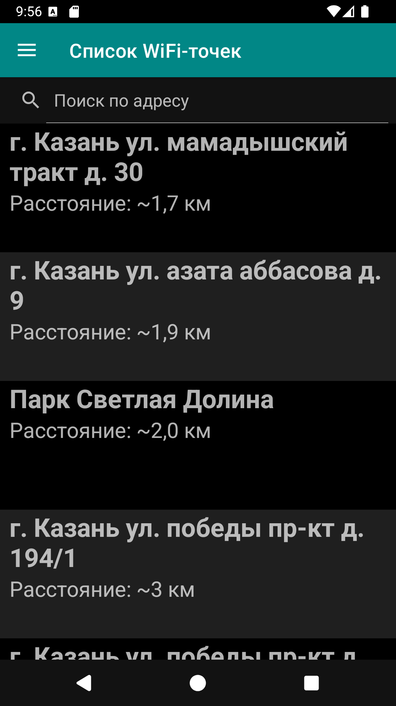

## Список публичных WiFi-точек в Татарстане ##

Неофициальное приложение, использующее базу WiFi-точек Минцифры
Республики Татарстан. Официальная карта находится по ссылке:

https://digital.tatarstan.ru/wifi-points.htm

Минусы этой карты в том что она не работает без Интернета. Т.е.
чтобы найти интернет уже нужен интернет. Ну или нужно заранее
планировать свой маршрут.

Это приложение работает без подключения к сети. Интернет нужен
только если возникнет необходимость обновить базу WiFi-точек.

Установить приложение можно из RuStore по ссылке:

https://www.rustore.ru/catalog/app/com.ylsoftware.tatwififree

Приложение поддерживает светлую и тёмную темы.

## Скриншоты ##

